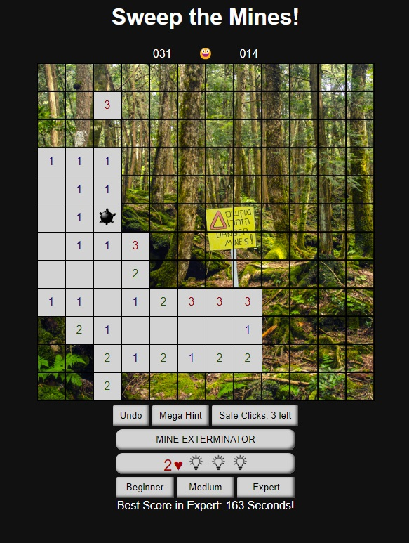

# Minesweeper - A Classic Game

Welcome to my custom Minesweeper game built with vanilla JavaScript! This project was created during a 3-day coding sprint at a Coding Academy Israel. I've added some exciting features to make the classic game even more enjoyable.

## Play

Play the game right now by clicking [here](https://dorezahavy.github.io/minesweeper/). There's no need to install anything.

## Basic Game

* Play the classic Minesweeper game.
* Uncover tiles to find hidden mines.
* Mark tiles with flags to prevent accidental clicks.

## Additional Features

* **Hints:** Get different kinds of hints to help you make educated guesses.
* **Undo:** Rewind your gameplay one move at a time, potentially all the way back to the initial state.
* **Mine Exterminator:** A powerful tool at your disposal. Eliminate three random mines on the game board.
* **Custom Mode:** Place mines manually for a unique challenge.

## Contact

If you have any questions or suggestions, feel free to contact me:
* Dore Zahavy
* Email: dorezahavy@gmail.com
* GitHub: https://github.com/DoreZahavy

